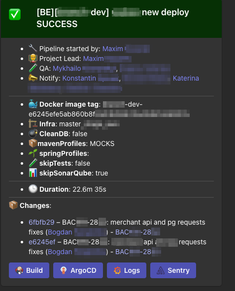
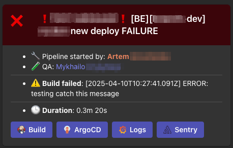

# Jenkins Shared Library — MS Teams Notification Framework

## 🎯 Use Case

Automated notifications to Microsoft Teams from Jenkins pipelines for development and DevOps teams.

The main goal is to automate the notification process about the build and release status in Jenkins pipelines with dynamic tagging of responsible employees based on data from YouTrack and Azure AD.

---

## 🛠️ Solution Architecture

GitLab → Jenkins → YouTrack API → Azure AD (Microsoft Graph API) → MS Teams (Adaptive Cards)

---

## 	🚀 Core Features

- Detecting pipeline author (manual run / Git webhook)
- Extracting issue ID from commit messages (format ABC-123)
- Fetching QA and Notify participants from YouTrack API
- Resolving correct user email addresses via Azure AD
- Generating `<at>` mentions for MS Teams
- Generating Adaptive Card for Teams with:
  - Build status (color, icon)
  - Mention summary
  - List of commits between builds
  - Error logs for failed builds
  - Links to Jenkins, Grafana, ArgoCD, Sentry
- Dynamic generation of Actions buttons (generateActions.groovy)

---

## 🧩 Shared Library Components

| File | Purpose |
|------|---------|
| buildMentionEntities.groovy | Generate MS Teams mentions |
| buildMentionSummary.groovy  | Generate mention summary |
| generateActions.groovy      | Generate action buttons for Adaptive Card |
| getFailedReason.groovy      | Extract error logs from Jenkins |
| getPipelineUser.groovy      | Detect pipeline author |
| getUserMailAzure.groovy     | Resolve user email from Azure AD |
| getYoutrackClient.groovy    | Initialize YouTrack API client |
| initNotificationTemplate.groovy | Initialize data for notification template |
| notifyMsTeams.groovy        | Send Adaptive Card to MS Teams |
| setNotificationTemplate.groovy | Final data preparation and trigger notification sending |

---

## 🧩 API Clients

| File | Purpose |
|------|---------|
| MicrosoftGraphClient.groovy | Work with Microsoft Graph API (Azure AD) |
| Youtrack.groovy             | Work with YouTrack API |
| ApiUtils.groovy             | Utilities for mapping YouTrack data to Azure data |

## 📸 Screenshots

### Success notification ✅

  

---

### Failed notification ❌

  

## 📖 Development Story

Full development story available here: [docs/notification_story_en.md](../../../docs/notification_story.md)
